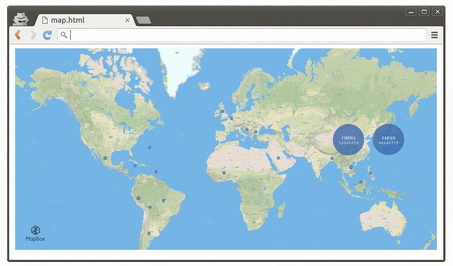

#Bubble Map
[](https://www.npmjs.com/package/bubble-map)

Easy-to-use library to visualize your country data in a complete world map (by the use of bubbles).  
Uses Mapbox tiles, D3 and topojson.  
Allows to zoom-in, zoom-out and live update of your data.  




## Dependencies

It is required to import topojson in your HTML (see demo as reference).  
Also to include the folder '/json' in the root of your project.  

```html
    <script src="topojson.js"></script>
```  

[D3](https://d3js.org/)
[Mapbox](https://www.mapbox.com)
[Less](http://lesscss.org/)

## API

  * <a href="#render"><code>map.<b>renderBubbles()</b></code></a>
  * <a href="#zoom"><code>map.<b>visitCountry()</b></code></a>

-------------------------------------------------------
<a name="render"></a>
### map.renderBubbles({data}, attrId)

Updata the data of the map from the json object.
Every attribute of the json object must be a country represented by its topojson id. The attribute contains another object with the value in its 'attrId' attribute.

-------------------------------------------------------
<a name="zoom"></a>
### map.visitCountry(id)

Map zooms into the country represented by the 'id'. If 'id' is empty map zooms out to display the whole map.

## Usage

1. Initialize the map by indicating the id of the HTML element where to display the map, the mapbox token provided from your mapbox account, and the desired width and height of the map.

```js
import BubbleMap from 'bubble-map/bundle/BubbleMap.js'

let map = new BubbleMap('myElementId', 'my_mapbox_token', 840, 400)
```  

2. Now we can render our information every time there is a relevant update of our data.

```js
map.renderBubbles({
  "JP": {"value": 62141773},
  "AR": {"value": 1773}
}, "value")
```  

3. We can even zoom-in and display a relevant value, i.e. zoom into Japan.

```js
map.visitCountry("JP")
```
